For this project, the focus is on identifying customers that are at risk of churning and then providing solutions on how to target and ensure they remain as customers. The final outcome of this project will be a classification model that takes in a number of variables (different characteristics) of a customer such as age, income level, amount of money spent and etc. to determine if this individual is more likely to stay with the bank or leave. To reach the stage of building the model, it is necessary to first ensure that the data being fed into the model is in an appropriate format. Usually, it is the case that the data is harder for humans to understand but better suited for machine interpretation. The first step in this 'preprocessing' stage is to select suitable variables depending on the needs of the project.
# Identify & Gather Data
The data provided for this project is a Microsoft Excel file with multiple sheets:
1. `Customer_Demographics`
2. `Transaction_History`
3. `Customer_Service`
4. `Online_Activity`
5. `Churn_Status`
The first four tables contain features for the model and the final table contains the label indicating whether or not a customer has churned (0 or 1). The first task for this project is to get all this data into a single table. However, the tables are of different lengths meaning it would not make sense to just perform a single join. Second, this the stage when the most important variables have to be selected. If all variables are selected and used for training the model, the importance and weighting of key variables is reduced and variables that are not as telling will be given weighting. Furthermore, just throwing in every single variable available means that the model takes longer to run. In a business setting, this translates to a more expensive model. The opposite case of selecting only a few variables is not ideal either. This would make the model sensitive and overly reliant on individual variables; smallest changes could change the way the model trains. Essentially, it is key to select a 'good' number of variables and ones that can be a good predictor of the label. In this case, this means selecting characteristics of a customer that helps indicate whether or not they are likely to churn.

Carrying on by considering the specifics of this project. The following section gives an overview of all the variables, some information on the data that can be found in that column, whether or not this field has been selected and the reason behind this decision.
### Table 1: `Customer_Demographics`

| Column name   | Information                                                               | Selected or Not | Reason                                                                                                                                                          |
| ------------- | ------------------------------------------------------------------------- | --------------- | --------------------------------------------------------------------------------------------------------------------------------------------------------------- |
| CustomerID    | Unique value for each customer ranging from 1 to 1000.              | Selected        | CustomerID is selected from  each table as it is the only field common across all five tables. However, won't be used as a feature for the model.   |
| Age           | Age of each customer.                                                     | Selected        | Differences in thought processes across different age groups can be considered.                                                                           |
| Gender        | Gender of each customer.                                                  | Not Selected    | Avoiding the chance of  introducing bias that one gender is more likely to churn than the other.                                                       |
| MartialStatus | Martial status of each customer.                                       | Not Selected    | Avoiding potential bias linked to socio-economic factors. Can be predictive but fairness has been prioritised in this case.                            |
| IncomeLevel   | Ordinal field with the possible values being low, medium, and high. | Selected        | Income level and hence financial decision making is a key factor in a customer's thought process involving whether or not they would like to leave. |
### Table 2: `Transaction_History`

| Column name     | Information                                                                | Selected or Not | Reason                                                                                                                                                       |
| --------------- | -------------------------------------------------------------------------- | --------------- | ------------------------------------------------------------------------------------------------------------------------------------------------------------ |
| CustomerID      | Value representing each customer ranging from 1 to 1000.          | Selected        | CustomerId is selected from each table as it is the only field common across all five tables. However, won't be used as a feature for the model. |
| TransactionID   | Unique value representing each transaction.                          | Not Selected    | Just metadata that is recorded for each transaction but has no use in this case.                                                                       |
| TransactionDate | The date a transaction is made.                                         | Not Selected    | Just metadata that is recorded for each transaction but has no use in this case.                                                                       |
| AmountSpent     | The amount of money.                                                    | Selected        | Similar to Income level from the previous table, any indication of a customer's financial situation should be considered.                           |
| ProductCategory | Transactions are grouped to give a general idea of their purpose. | Not Selected    | Could provide some interesting insights such as the preferences of a customer but correlation between this and churning seems negligible.        |
### Table 3: `Customer_Service`

| Column name      | Information                                                                | Selected or Not | Reason                                                                                                                                                            |
| ---------------- | -------------------------------------------------------------------------- | --------------- | ----------------------------------------------------------------------------------------------------------------------------------------------------------------- |
| CustomerID       | Value representing each customer ranging from 1 to 1000.          | Selected        | CustomerId is selected from each table as it is the only field common across all five tables. However, won't be used as a feature for the model.      |
| InteractionID    | Unique value representing each interaction.                          | Not Selected    | Just metadata that is recorded for each interaction but has no use in this case.                                                                            |
| InteractionDate  | The date there is an interaction.                                       | Not Selected    | Just metadata that is recorded for each interaction but has no use in this case.                                                                            |
| InteractionType  | Interactions are grouped to give a general idea of their purpose. | Selected        | Since one of the possible interactions is a complaint, this can provide insights whether complaint(s) leads to churning.                                 |
| ResolutionStatus | Whether or not a particular interaction was resolved or not.      | Selected        | In combination with the `InteractionType` column, these features can reveal patterns - such as unresolved complaints that may lead to customer churn. |
### Table 4: `Online_Activity`

| Column name    | Information                                                                    | Selected or Not | Reason                                                                                                                                                                              |
| -------------- | ------------------------------------------------------------------------------ | --------------- | ----------------------------------------------------------------------------------------------------------------------------------------------------------------------------------- |
| CustomerID     | Value representing each customer ranging from 1 to 1000.              | Selected        | CustomerID is selected from each table as it is the only field common across all five tables. However, won't be used as a feature for the model.                        |
| LastLoginDate  | The date the last time a customer used a digital banking service.     | Not Selected    | Project being completed in 2025. Any insights taken from the field would be outdated.                                                                                         |
| LoginFrequency | Number of times a customer has used digital banking services.         | Selected        | Gives an idea the number of  times a customer uses the digital services a bank provides.                                                                                      |
| ServiceUsage   | Digital usage grouped into  website, online banking and phone app. | Selected        | Including this reveals customers' channel preferences and engagement patterns, which can help identify different churn risks and highlight potential service issues. |
### Table 5: `Churn_Status`

| Column name | Information                                                       | Selected or Not | Reason                                                                                                                                                       |
| ----------- | ----------------------------------------------------------------- | --------------- | ------------------------------------------------------------------------------------------------------------------------------------------------------------ |
| CustomerID  | Value representing each customer ranging from 1 to 1000. | Selected        | CustomerID is selected from each table as it is the only field common across all five tables. However, won't be used as a feature for the model. |
| ChurnStatus | Whether a  customer has churned or not.                     | Selected        | The main column of this dataset. Will help train the model, hence, supervised machine learning.                                                        |
## Data Integration
To create a unified dataset suitable for churn prediction, each table must first be prepared individually at the customer level. Since some tables contain multiple records per customer (e.g., transaction history, customer service interaction), aggregation operations are performed to summarise these data points into meaningful customer-level features. For example, transaction data is aggregated to calculate total purchase counts and average spend per customer, while customer service records are summarised into counts of different interaction types and resolution rates.

Following the derivation of these aggregated features, the `Customer_Demographics` table, which contains a comprehensive list of 1,000 unique customers, is used as the base table for integration. Left joins of each aggregated feature table **are** performed onto this demographic base. This approach ensures the retention of all customers in the final dataset, including those without activity recorded in every transaction or interaction table.

Non-essential columns such as `transactionID` and raw timestamps are removed prior to aggregation to simplify the data and focus on relevant predictive information. This structured data preparation strategy enables the creation of a consistent, customer-level dataset that captures both demographic and behavioural factors essential for effective churn modelling.
### Data Integration in Action
The integration process began by preparing each table individually to ensure that all data was summarised at the customer level. Aggregation was applied to tables containing multiple records per customer, such as the transaction history and customer service interactions. Key features such as total purchases, average and total spend, number of service interactions, and resolution rate were derived through these operations. Tables already structured at the customer level, like the login activity and churn status data, required minimal transformation.

Once aggregation was complete, all feature tables were merged onto the `Customer_Demographics` table using left joins on `CustomerID`. This approach ensured that all 1,000 customers were retained in the final dataset, even if some had no recorded activity in other tables. Columns that were not meaningful for modelling, such as raw timestamps, unique IDs, and redundant fields, were excluded to keep the dataset concise and relevant.

The final result is a consolidated dataset with 15 columns, including both demographic and behavioural features alongside the target variable, `ChurnStatus`. This master table forms the basis for further analysis and model development.

# Exploratory Data Analysis
## Step 1: Initial Overview
The final integrated dataset contains 1,000 rows and 15 columns, with each row representing a unique customer. A preliminary inspection using `.head()`, `.info()`, and `.shape` confirms that the data has been loaded correctly and is well-aligned. 

A scan for missing values reveals that **only three columns contain null entries**, all of which are derived from the `Customer_Service` table:
- `TotalInteractions`
- `ResolvedCount`
- `ResolutionRate`
These null values correspond to customers who have never interacted with customer service, and therefore have no interaction-related records to aggregate. This pattern is expected and will be further addressed in the missing value analysis stage (Step 4). No other columns contain missing values.
## Step 2: Data Types
The dataset's data types are reviewed to ensure each feature is appropriately formatted for analysis and modelling. Categorical variables such as `Gender`, `MaritalStatus`, `IncomeLevel`, and `ServiceUsage` are converted from object types to category types to save memory and make them easier to use later on. Numerical columns, including the target variable `ChurnStatus`, retain their integer or float types, as this format is compatible with most machine learning algorithms for binary classification. This preparation lays a solid foundation for subsequent exploratory data analysis and model development.
## Step 3: Duplicate and Constant Value Checks
The dataset is assessed for duplicate records and features with no variation. No duplicate rows are found, confirming the uniqueness of all records. Additionally, all columns exhibit more than one unique value, indicating the absence of constant features. This ensures that the dataset doesn't contain any redundant or non-informative variables.
## Step 4: Missing Values
A review of missing data reveals that only three features (`TotalInteractions`, `ResolvedCount`, and `ResolutionRate`) contain null values, with 332 missing entries each. These features are derived from the table recording customer service interactions; hence, the missing values correspond to customers who had no recorded customer service interaction. As such, the nulls do not represent missing data but rather indicate an absence of interaction. These values are imputed with zero to retain their meaning and maintain consistency in the dataset. According to the requirements outlined on the Forage platform, this step is intended to be addressed later during the data cleaning and preprocessing phase, where encoding, standardisation, and other transformations are applied to prepare the dataset for machine learning.
## Step 5: Descriptive Statistics
### 5.1 - Numerical Features
#### 5.1.1 - `Age`
The variable `Age` has a mean of 43.2 years and a standard deviation of 15.2, with values ranging from 18 to 69. The distribution is notably uniform, with the KDE plot appearing relatively flat across the age spectrum and tapering off at the extremes. The boxplot reinforces this observation, showing a symmetrical spread around the median, with approximately equal distances between the 25th and 75th percentiles and the median. No outliers are detected according to the IQR method, and there is no visible skewness in the data. The even distribution suggests a balanced representation or segmentation, age could be grouped into generational bands (e.g., 18-25, 26-35, 36-45, 46-55, 56+) to explore behavioural patterns across different age groups.
#### 5.1.2 - `TotalPurchases`
The number of purchases per customer has a mean of 5.05 and a standard deviation of 2.60, with values ranging from 1 to 9. The median aligns closely with the mean at 5, indicating a roughly symmetrical distribution. The histogram reveals a fairly uniform spread across purchase counts, though some intermediate values (such as 3-4 and 6-7) appear slightly less frequent. A boxplot confirms the uniformity within the interquartile range (IQR), and no outliers are detected based on the IQR method. Overall, `TotalPurchases` is well-distributed with no extreme values, making it a stable feature for modelling.
#### 5.1.3 - `AvgSpend`
The `AvgSpend` variable displays a roughly normal distribution with a mean of 248 and a median of 250, suggesting minimal skew. However, outlier analysis using the IQR method identifies 22 lower-end outliers (below ~75) and 16 higher-end outliers (above ~420), accounting for around 3-4% of the dataset. These values likely reflect naturally occurring customer behaviour, such as very low or very high spending patterns, rather than data entry errors. Given the small proportion and the plausible nature of these values, no action is taken at this stage. Further analysis in the bivariate stage will assess whether these outliers have a meaningful relationship with churn, which will inform any final decision to cap or retain them.
#### 5.1.4 - `TotalSpend`
The `TotalSpend` variable has a mean of 1,267, median of 1,232, and a relatively high standard deviation of 783, indicating a wide spread in spending behaviour. The minimum value is 9.8, while the maximum reaches 3,386, reflecting a significant range in total customer spend. This is expected, as some customers may have only a single purchase while others may be repeat buyers. The distribution is right-skewed, with the majority of values clustered below 1,750 and a tail extending toward higher amounts. Despite this skew and large range, no statistical outliers were detected using the IQR method, suggesting that while some customers spend significantly more than others, these high values are still within a reasonable spread of the data. No transformation or capping is applied at this stage, though skewness may be consider later during feature engineering.
#### 5.1.5 - `TotalInteractions`
The `TotalInteractions` feature reflects how often customers contacted customer service. The mean is 1.002, the median is also 1, with a standard deviation of 0.82. Values range from 0 to 2, and the distribution is uniform, with approximately equal representation across the three intervals. The boxplot confirms the absence of outliers, as the IQR spans the full data range and no extreme values are detected. Given the limited and well-behaved range, this feature is clean and ready for modelling without any need for transformation or capping. However, there may be merit in transforming this variable into a binary indicator, flagging whether or not a customer has contacted customer service at all. While this simplification could reduce dimensionality, it would typically result in a loss of granularity, as customers with significantly different levels of engagement (e.g., one interaction vs. ten) would be treated identically. In this case, however, the maximum number of interactions is only two, so converting the variable to binary would likely preserve most of the information while making the feature more interpretable and model-friendly.
#### 5.1.6 - `ResolvedCount`
The `ResolvedCount` variable has a mean of 0.523 and median of 0, indicating that more than half of the customers either had no resolved issues or no customer service interactions at all. The values range from 0 to 2, suggesting that, at most, only two issues has been resolved per customer. The histogram, split into two bins (0-1 and 1-2), shows a relatively balanced distribution with approximately 550 customers falling into the 0-1 range and around 450 in the 1-2 range. The boxplot reinforces this structure, with an IQR from 0-1, no lower whisker, and a whisker extending to 2. There are no outliers based on the IQR method. 

As with `TotalInteractions`, the limited numeric range suggests that this variable could be considered for binarisation, indicating simply whether at least one issue was resolved. However, with a substantial portion of values between 1 and 2, this transformation may lead to a greater loss of granularity than in the `TotalInteractions` case, and should therefore be approached with caution. This is because `TotalInteractions` being simplified would just represent did they make contact or not? However, with `ResolvedCount` it tells us how many issues were resolved, which might influence churn behaviour more directly.
#### 5.1.7 - `ResolutionRate`
The `ResolutionRate` variable records the proportion of customer service interactions that were successful resolved. It exhibits a mean of 0.35, with a median of 0. While the median suggests many customers had no resolved interactions, it is more likely it reflects the customers that had no interactions with customer service. As expected, the values range cleanly between 0 and 1. The histogram reveals that over half the customers fall into the lowest resolution tier (0-0.33), while the remainder are distributed across the middle and upper thirds, indicating some variation in resolution success. The boxplot consists solely of the interquartile range with no whiskers, and the IQR method confirms the absence of outliers. 

Given that `ResolutionRate` encapsulates both interaction occurrence and outcome quality, it may serve as a more informative and compact feature compared to `TotalInteractions` and `ResolvedCount`. Since these three variables are all derived from the same source, retaining only `ResolutionRate` could help reduce redundancy and improve model efficiency, without significantly compromising interpretability or information value. This option will be considered further during the feature pruning stage.
#### 5.1.8 - `LoginFrequency`
The `LoginFrequency` variable captures how often each customer has accessed the platform in any form (Mobile Banking, Website, Online Banking). It shows a mean of 25.9, a median of 27, and a standard deviation of 14, with observed values ranging from 1 to 49. These statistics indicate a moderate spread around the central tendency, with a slightly right-skewed distribution suggested by the mean being marginally lower than the median. 

The histogram, divided into five equal-width bins, displays a roughly uniform distribution across the range, with a minor concentration in the 30-40 interval. This pattern implies a broad spread of login behaviours among customers, without strong clustering around a particular frequency level. The boxplot confirms the absence of outliers, showing a well-distributed IQR with no extreme values beyond the whiskers. This was further verified using the IQR method. Overall, `LoginFrequency` appears to be a stable and informative behavioural metric, potentially offering valuable insights into customer engagement in the context of churn prediction.
### 5.2 - Categorical Features
Of the four categorical variables available (`Gender`, `MaritalStatus`, `IncomeLevel`, and `ServiceUsage`), only `IncomeLevel` and `ServiceUsage` are selected for further analysis. The features `Gender` and `MaritalStatus` are intentionally excluded from EDA and subsequent modelling. This is to avoid the risk of introducing socio-economic bias that may inaccurately suggest that a particular gender of marital status is more likely to churn. Focusing on behavioural and service-related variables ensures that the model priorities actionable insights over potentially sensitive demographic traits.
#### 5.2.1 - `IncomeLevel`
The `IncomeLevel` variable comprises three categories: *High*, *Medium*, and *Low*. The relative frequencies are fairly balanced, with 34.9% of customers in the *High* category, 32.6% in *Medium*, and 32.5% in *Low*. A bar plot of the distribution confirms this even spread. This uniformity suggests that income level is well-represented across the customer base and may serve as a useful input in understanding churn behaviour without the risk of imbalance.
#### 5.2.2 - `ServiceUsage`
The `ServiceUsage` variable includes three categories: *Mobile App*, *Online Banking*, and *Website*, with relative frequencies of 34.9%, 34.2%, and 30.9% respectively. A bar plot confirms that these service channels are fairly evenly used across the customer base. The balanced distribution ensures that the variable is well-suited for modelling without the need for further transformation or handling of rare categories.
### 5.3 - Target Variable Analysis
The analysis of the target variable `ChurnStatus` reveals a moderate class imbalance, with 79.6% of customers labelled as non-churners and 20.4% as churners. While not extreme, this imbalance is significant enough to potentially bias the performance of machine learning models, particularly in underpredicting the minority class. The address this, there are a few strategies available. These include applying class weighting within the modelling algorithm to penalise misclassification of the minority class, using synthetic oversampling techniques such as SMOTE to augment the churner class, or under sampling the majority class to balance the dataset. Though the last option risks losing valuable data and is less suitable in this case, it is the simplest method to apply. Depending on the time available and results during model training, one or more of these techniques will be explored and evaluated using appropriate performance metrics such as precision, recall, F1-score, and ROC-AUC.
## Step 6: Outlier Detection
A formal outlier check confirmed that among the numerical features, only `AvgSpend` contained significant outliers. All other variables showed no outliers under standard detection techniques. Outliers in `AvgSpend` will be addressed during the data preprocessing stage, where a decision between capping or removal will be considered based on modelling needs.
## Step 7: Bivariate Visuals
In this step, a bivariate visual analysis is conducted by separating features into numerical and categorical types. For numerical features, boxplots and violin plots are used to compare the distribution between churners and non-churners, alongside calculating the average values for each group. For categorical features, count plots are created to visualise the proportion of churners versus non-churners within each category, supported by calculating the churn rate across each group. This helps identify potential predictive relationships between features and the target variable.
### 7.1 - Numerical Features
#### 7.1.1 - `Age`
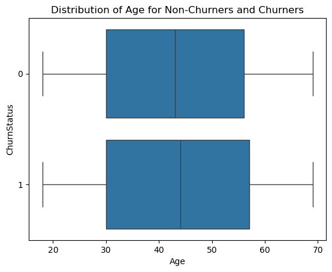
The box plot comparing age distributions between churners and non-churners reveals a subtle upward shift for customers who churned. Both the median and third quartile values are slightly higher among churners, suggesting they tend to be older on average. This further supported by the descriptive statistics: the mean age for non-churners is 43.04, while for churners it rises to 44.15. Similarly, the median increases from 43.0 to 44.0. While the difference is modest, it may indicate that older customers are marginally more likely to churn.
#### 7.1.2 - `TotalPurchases`
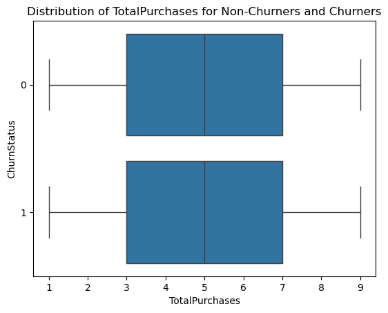
For `TotalPurchases`, the boxplots for churners for non-churners exhibit similar distributions. The mean number of purchases is 5.07 for non-churners and 5.01 for churners, with both groups sharing a median value of 5. This suggests that the purchase frequency does not differ significantly between the two groups.
#### 7.1.3 - `AvgSpend`
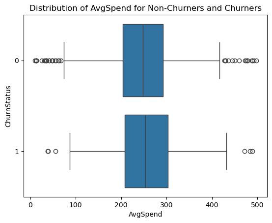
For `AvgSpend`, the boxplot reveals noticeable differences between churners and non-churners. The median, first quartile, and third quartile values are all higher for churners, suggesting that customers who churn tend to spend more on average. Interestingly, while we previously identified outliers in this variable, the majority of these outliers belong to non-churners. In terms of central tendency, the mean spend is £247.01 for non-churners and £255.83 for churners. while the median values are £248.28 and £252.71, respectively. This points to a modest but consistent trend of higher average spending among churned customers.
#### 7.1.4 - `TotalSpend`
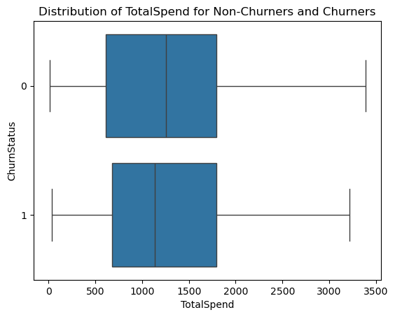
For `TotalSpend`, the median spend is notably higher for non-churners (£1,255) than for churners (£1,135), suggesting that customers who remain tend to spend more overall. Although the mean values are similar, £1,266 for non-churners and £1,269 for churners, this closeness masks differences in distribution. The boxplot reveals that the first quartile is slightly higher for churners, while the third quartile is roughly similar for both groups. However, non-churners show a higher maximum value, indicating the presence of high-spending loyal customers. Overall, the data suggest that while average spend may not differ significantly, higher median and maximum spend could be associated with customer retention.
#### 7.1.5 - `LoginFrequency`
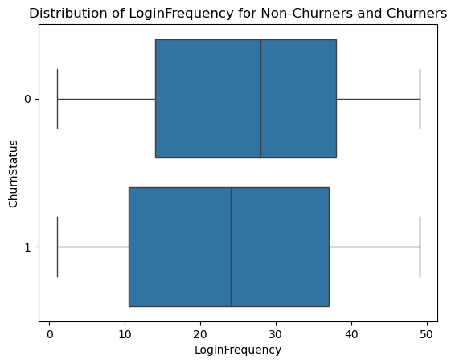
For `LoginFrequency`, non-churners tend to engage with the service more regularly. The mean number of logins 26.5 for non-churners compared to 23.6 for churners, and the median follows a similar pattern (28 and 24). The boxplot further supports this, showing that the first and third quartiles are both higher for non-churners. Additionally, the IQR is smaller for non-churners, suggesting a more consistent pattern of login behaviour among retained customers. These differences indicate that higher and more stable login activity may be linked to customer retention.
#### 7.1.6 - `ResolutionRate`
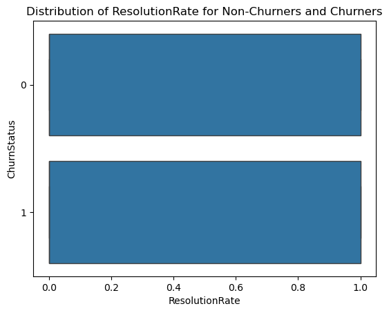
For `ResolutionRate`, there is little difference observed between churners and non-churners. The median is 0 for both groups, and the mean is nearly identical; 0.35 for non-churners and 0.36 for churners. The boxplots for both groups are minimal, consisting only of the IQR with no whiskers or outliers, indicating a tightly clustered distribution around the lower end. This suggests that resolution rate may not significantly differentiate churn behaviour in this dataset.
### 7.2 - Categorical Features
#### 7.2.1 - `IncomeLevel`
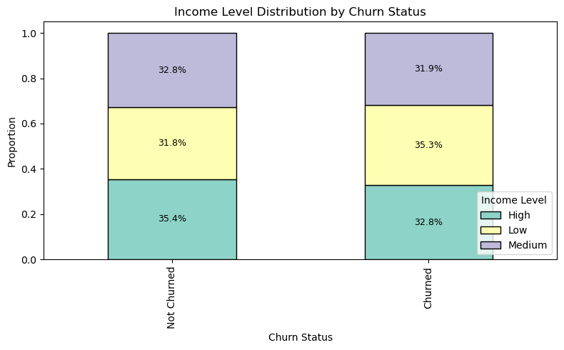
The stacked bar plot shows that for both churners and non-churners, the distribution of income levels is relatively even. Each income group, *Low*, *Medium*, and *High*, account for roughly one-third of the population in both categories.

When examining the churn rate within each income group, the proportions remain consistent across all categories. Approximately 80% of customers in each income level did not churn, while around 20% did churn, suggesting that `IncomeLevel` doesn't appear to be a strong differentiating factor in customer churn. The even distribution indicates minimal predictive power of this feature for the churn classification task.
#### 7.2.2 - `ServiceUsage`
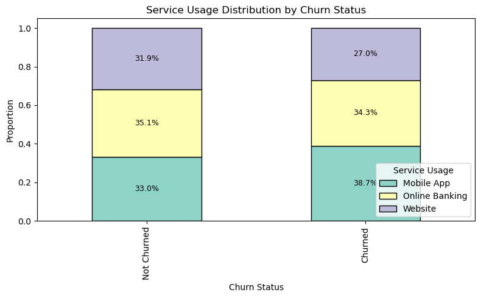
The stacked bar plots and group-wise churn proportions reveal some variation in churn behaviour based on the primary service channel used:

|                    | Churn | Non-Churn |
| ------------------ | ----- | --------- |
| **Mobile App**     | 23%   | 77%       |
| **Online Banking** | 20%   | 80%       |
| **Website**        | 18%   | 82%       |
While the majority of customers in each group are non-churners, mobile app users show a slightly higher churn rate compared to website users. This could indicate that customers relying on the mobile app may be slightly more likely to leave, potentially due to usability issues, limited functionality, or other friction in the mobile experience. Although these differences are relatively minor, they may warrant further investigation or be considered as a weak predictor in the churn model.
## Step 8: Correlation Matrix
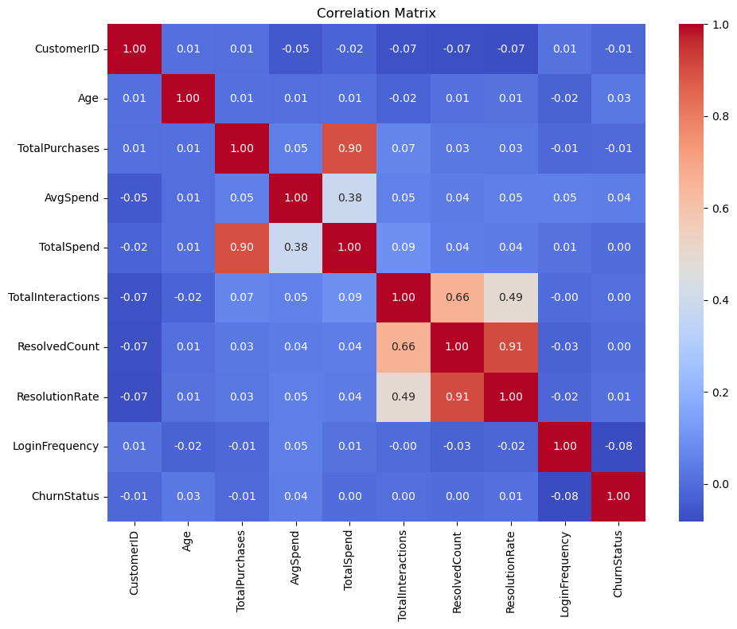
To evaluate the linear relationships between numerical variables, a correlation matrix can be generated. The results show the following:

- `TotalPurchases` and `TotalSpend` are strongly correlated with a coefficient of 0.90, which is expected since total spend is a function of the number of purchases and average spend.
- `ResolvedCount` and `ResolutionRate` show a high correlation of 0.91, as resolution rate is directly derived from resolved count and total interactions.
- `ResolvedCount` and `TotalInteractions` have a moderate correlation of 0.66, reflecting that more interactions generally lead to more resolved cases.

Other than these, all other pairs showed low correlation (between -0.1 and 0.1), including `ChurnStatus`, which had no strong linear relationship with any numerical feature. While this might initially appear concerning, it's not unusual. Churn is often influenced by non-linear and interaction effects, which may not be captured by simple linear correlation. These relationships are better uncovered during modelling, especially with tree-based algorithms that do not rely on linearity.

Going forward, the strong correlations between some variables (e.g. `TotalPurchases` & `TotalSpend`, `ResolvedCount` & `ResolutionRate`) will be taken into account during feature pruning to avoid multicollinearity.
## Step 9: Preliminary Feature Importance
### 9.1 - Numerical Features
A comparison of the mean values of numerical features between churners and non-churners revealed a few notable differences:

- **Average Spend:** Churners have a higher average spend (+8.22), suggesting that higher-spending customers may be more likely to churn.
- **Total Spend:** A small but positive difference (+2.43), consistent with the higher average spend.
- **Age:** Churners are on average slightly older (+1.11 years)
- **Login Frequency:** Churners log in less frequently (-2.85), indicating reduced engagement.

All other features, aside from `CustomerID` (which won't be used for the model), showed negligible differences (~0.01), suggesting limited separation between churners and non-churners for those variables at the mean level.
### 9.2 - Categorical Features
The table below shows the proportion of non-churners and churners for each category within the two categorical features:

| Feature           | Category       | % Non-Churn | % Churn |
| ----------------- | -------------- | ----------- | ------- |
| **Income Level**  | High           | 80.80       | 19.20   |
|                   | Medium         | 77.85       | 22.15   |
|                   | Low            | 80.06       | 19.94   |
| **Service Usage** | Mobile App     | 76.90       | 23.10   |
|                   | Online Banking | 79.94       | 20.06   |
|                   | Website        | 82.20       | 17.80   |
There is no significant imbalance across the Income Level categories, with churn rates hovering close to 20%. However, Service Usage shows some variation. Churn is more common among 'Mobile App' users and least common among 'Website' users. These subtle differences might be worth exploring further during the modelling phase.
## Step 10: EDA Summary
The exploratory data analysis commenced with a structural audit of the dataset. All fields were assessed for missing or duplicate values, with none identified. A key observation from the outset was a class imbalance in the target variable `ChurnStatus`, with approximately 20.4% of customers having churned. While not extreme, this imbalance will require consideration in later modelling, potentially through resampling techniques or algorithmic class weighting.

Numerical features such as `Age`, `TotalPurchases`, `AvgSpend`, `TotalSpend`, `LoginFrequency`, `TotalInteractions`, `ResolvedCount`, and `ResolutionRate` were then examined individually. Most exhibited relatively uniform or normal distributions. `AvgSpend` was the only variable with notable outliers, while others showed on irregularities under both visual inspection and statistical thresholds. Particular attention was given to the interaction-related variables, where it was concluded that `ResolutionRate` offers the most meaningful summary metric. As a result, `TotalInteractions` will be simplified to a binary field, and `ResolvedCount` may be excluded due to limited additional insight. Categorical features (`IncomeLevel` and `ServiceUsage`) displayed well-balanced distributions, though minor differences in churn behaviour across service types was observed.

Bivariate analysis deepened this understanding, with boxplots and group-wise means revealing modest differences between churners and non-churners. For instance, churners showed slightly higher `AvgSpend` and lower `LoginFrequency`, while `TotalSpend` was marginally higher among non-churners. Correlation analysis identified strong relationships between `TotalPurchases` and `TotalSpend` (r=0.90), and between interaction metrics, suggesting multicollinearity that may influence feature selection. Preliminary feature importance, assessed through group means and category-wise churn rates, supported the relevance of features such as `AvgSpend`, `LoginFrequency`, and `ServiceUsage` in predicting churn, providing a clear direction for the upcoming modelling and feature engineering phase.
# Cleaning & Preprocessing
## Step 1: Handling Missing Values
Upon inspection, missing values were identified in fields related to customer service interactions, specifically, `TotalInteractions`, `ResolvedCount`, and `ResolutionRate`. These missing entries were not due to data entry errors but instead corresponded to customers who had not contacted customer service at all. Therefore, these were logically imputed with 0s, reflecting the absence of interaction rather than a missing observation. This ensured the dataset retained its integrity while accurately representing customer behaviour.
## Step 2: Outlier Treatment
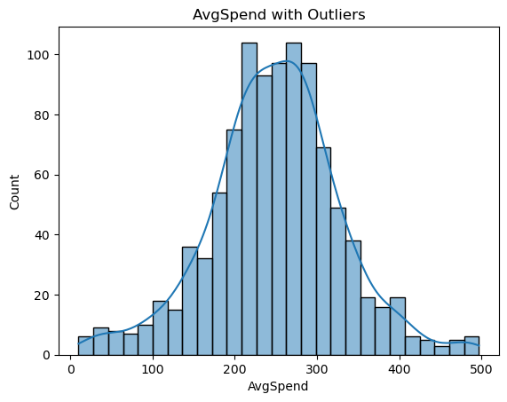
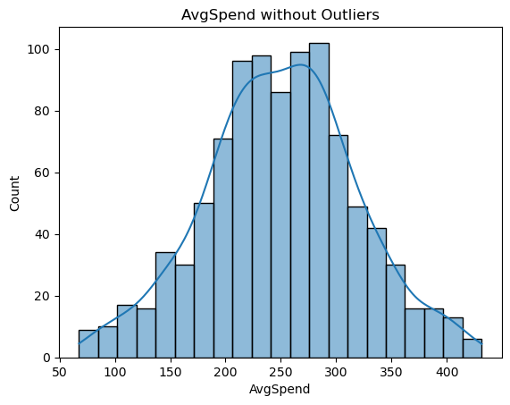
Outlier detection identified 38 records within the `AvgSpend` feature as being outside the 1.5xIQR bounds. The majority of these (84.2%) belonged to non-churners, and hence their removal does not exacerbate the existing class imbalance. Furthermore, the mean increased only marginally from 248.8 to 250.4 upon exclusion of these outliers, suggesting limited overall impact. Visual inspection of the histogram revealed that removing outliers helped reduce the peakedness of the distribution, resulting in a more balanced shape. Given that these outliers are not erroneous but may distort model training due to their extremity, they were removed from the dataset to improve overall distributional consistency and mitigate the influence of heavy tails. 
## Step 3: Feature Scaling
Feature scaling was applied to the relevant numerical features (`Age`, `TotalPurchases`, `AvgSpend`, `TotalSpend`, `LoginFrequency`, and `ResolutionRate`) using standardisation (z-score). This transformation centres the data around a mean of 0 with a standard deviation of 1. This ensures that features with larger numerical ranges do not disproportionately influence model performance. Scaled features were added to the dataset as new columns, preserving the original values for reference if needed during further analysis.
## Step 4: Encoding Categorical Features
Two categorical features, **`IncomeLevel`** and **`ServiceUsage`**, were encoded using one-hot encoding to convert them into a machine-readable format. For each of these variables, dummy variables were created while dropping one category from each as a reference category to avoid multicollinearity. Specifically, 'High' was dropped from `IncomeLevel`, and 'Mobile App' was dropped from `ServiceUsage`, thereby serving as the base categories in subsequent modelling.

In addition, the variable **`TotalInteractions`**, which originally represented the number of times a customer contacted customer service, was transformed into a binary feature named `Interacted`. This new variable takes the value 1 if the customer contacted customer service at least once, and 0 otherwise. Given the original maximum value was only 2, this transformation simplifies the variable while preserving the key distinction in behaviour. The original `TotalInteractions` field was subsequently removed. 

This step ensures all categorical variables are encoded appropriately and prepares the dataset for final feature selection and modelling.
## Step 5: Final Feature Selection
In the final stage of feature preparation, a refined subset of variables was selected to be included in the modelling process. This involved removing features that were either redundant, non-informative, or ethically inappropriate for use.

The `CustomerID` field was dropped as it serves solely as an identifier and holds no predictive value. `ResolvedCount` was removed due to its high correlation with both `TotalInteractions` and `ResolutionRate`, making it redundant. Similarly, `TotalPurchases` was excluded, as its information is already captured in `TotalSpend`, a more comprehensive metric.

The `Gender` and `MaritalStatus` variables were deliberately excluded to mitigate potential socio-economic bias and ensure the model does not make decisions based on sensitive demographic attributes. Lastly, `LastLoginDate` was not included as it had not been transformed into a more meaningful numerical or categorical feature (e.g., recency), thus offering little modelling value in its raw form.

The remaining features, such as scaled versions of numerical variables (`Age`, `AvgSpend`, `TotalSpend`, `LoginFrequency`), encoded categorical features (`IncomeLevel`, `ServiceUsage`), `ResolutionRate`, and a binary version of `TotalInteractions`, were retained as they offer strong interpretability and potential predictive power.
# Conclusion
This exploratory data analysis and preprocessing stage has laid a solid foundation for the predictive modelling phase. Key variables were thoroughly examined, with outliers addressed and categorical variables appropriately encoded. The final feature set balances relevance and model readiness, ensuring the data is primed for effective churn prediction. The subsequent modelling will focus on leveraging these insights to build robust classifiers and evaluate their performance.

