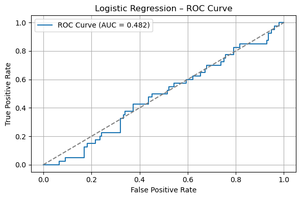
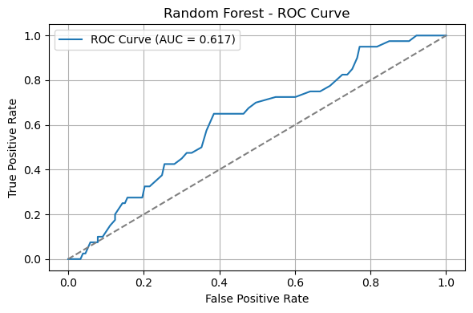

# Introduction
This section outlines the initial steps taken to prepare the dataset for predictive modelling, specifically for the task of customer churn classification. The primary objective is to develop and evaluate machine learning models capable of accurately identifying customers who are likely to churn, thereby enabling the business to implement timely retention strategies.

To begin, all necessary Python modules and libraries were imported, including those required for data handling (`pandas`, `numpy`), visualisation (`matplotlib`, `seaborn`), preprocessing (`scikit-learn`), resampling (`SMOTE` from `imblearn`), and modelling (`LogisticRegression`, `RandomForestClassifier`, and `XGBClassifier`).

The cleaned and preprocessed dataset, which was worked on in the previous phase, was imported into the working environment. A preliminary inspection was conducted to verify the shape of the dataset, inspect data types, and preview the first few rows to ensure data integrity.

The dataset was then split into features (`X`) and the target variable (`y`), with the target being the binary churn indicator, `ChurnStatus`. An initial analysis of the target variable revealed a clear class imbalance: approximately 79.4% of the observations were non-churners, while only 20.6% represented churners. This imbalance, though not extreme, posed a potential risk of bias during model training, where the model might favour the majority class.

To mitigate this issue, the dataset was divided into training and testing sets using an 80/20 stratified split, ensuring the class proportions were preserved in both subsets. This was done using the following argument in the `train_test_split` function: `stratify=y`, hence the class imbalance is maintained in both the training and testing data. Subsequently, the Synthetic Minority Over-Sampling Technique (SMOTE) was applied exclusively to the training data. This technique synthetically generates new examples of the minority class to balance the dataset. As a result, the training data was successfully balanced, containing 611 observations of each class, resulting in a total of 1,222 observations. The test set remained untouched to provide an unbiased evaluation of model performance.

These preparatory steps ensure that the forthcoming models are trained on a representative dataset, thereby improving their generalisability and robustness when predicting customer churn in real-world scenarios.
# Model Selection Strategy
Following the completion of data preparation and the mitigation of class imbalance using SMOTE, the next phase of the project involves identifying the most appropriate machine learning model to accurately predict customer churn. The predictive task at hand is a binary classification problem, with the aim of distinguishing between customers likely to churn and those expected to remain. Given the business importance of accurately identifying potential churners, particularly in the context of customer retention strategies, model performance is a key consideration, with a target of achieving a predictive accuracy or recall in the region of 85% or higher. To this end, a small pool of classification algorithms has been selected based on their performance characteristics, interpretability, and suitability for the size and structure of the dataset. The training set, balanced through synthetic oversampling, contains approximately 1,200 observations, while the test set consists of roughly 200 observations and retains its original imbalance to reflect real-world deployment conditions.

The first model selected is **Logistic Regression**, which serves as a strong baseline due to its simplicity and high interpretability. This model is particularly useful for generating insights into the relationships between individual features and the probability of churn, which may be of interest to business stakeholders.

The second model under consideration is the **Random Forest Classifier**, an ensemble learning method known for its robustness and ability to handle both linear and non-linear relationships. Random Forests also offer a degree of interpretability through feature importance rankings, making them a balanced choice between accuracy and explain-ability.

In addition, **Extreme Gradient Boosting** (**XGBoost**) has been selected for evaluation. This model is known for its high performance, particularly on tabular data, and includes mechanisms for handling class imbalance, such as weighted loss functions. Although less interpretable than Logistic Regression, XGBoost may provide superior predictive accuracy and will therefore be included in the comparison.

These three models represent a practical balance between predictive power and model transparency, both of which are crucial in a financial services context such as customer churn prediction at a bank. Each model will be trained on the resampled training data and evaluated on the untouched test set using appropriate classification metrics, including F1 score, ROC-AUC, and confusion matrices. The results will inform the final model selection, which will be carried forward for further refinement, evaluation, and business interpretation in subsequent steps.
# Testing and Evaluating Models
## 1 - Logistic Regression
As an initial benchmark, a Logistic Regression model was trained on the resampled training data, without applying any additional class weighting, as the SMOTE technique had already addressed class imbalance within the training set. The model was then evaluated on the untouched test set, which reflects the real-world class distribution.

The following performance metrics were recorded on the test set:
- **F1 Score:** 0.299
- **ROC-AUC Score:** 0.482
- **Accuracy:** 53.9%
- **Confusion Matrix:**
$$
\begin{bmatrix}
85 & 68 \\
21 & 19
\end{bmatrix}
$$
These results suggest that the logistic regression model performed only marginally better than random guessing. The F1 score, which balances precision and recall, was notably low, indicating poor handling of the minority class (churners). Similarly, the ROC-AUC score of 0.482 suggests that the model failed to discriminate effectively between churners and non-churners. The confusion matrix further highlights these issues: the model correctly identified only 19 true churners, while misclassifying 68 non-churners as churners and 21 churners as non-churners. This misclassification of churners is particularly problematic in a business context, where the cost of failing to identify customers at risk of churn can be significant.

The ROC curve for the Logistic Regression model reveals significant performance issues. Rather than demonstrating a consistent ability to distinguish between churners and non-churners, the curve fluctuates around the reference line representing random classification. In particular, the model starts below the line, momentarily rises above it, and then hovers inconsistently around the diagonal. The area under the curve (AUC) is just 0.482, indicating that the model's predictions are, on average, worse than those of a random classifier. This reinforces the earlier finding from the F1 score and confusion matrix that logistic regression is unsuitable for this task without significant improvement.

In summary, although logistic regression offers interpretability, its predictive performance in this case is insufficient. These results justify the need to evaluate more complex models, such as Random Forest and XGBoost, which may better capture non-linear relationships and interactions within the data.
## 2 - Random Forest
To assess the performance of a more flexible, non-linear model, a Random Forest classifier was trained on the SMOTE-resampled training dataset and evaluated on the original, imbalanced test set. This model was selected due to its ability to handle non-linear relationships, interactions between variables, and its robustness to overfitting.

The Random Forest model demonstrated a modest improvement in several performance metrics when compared to the previously tested Logistic Regression model. It achieved an accuracy of 72.5%, which is notably higher. However, this figure is influenced by the class imbalance in the test data and should be interpreted with caution. More informative metrics for imbalanced classification include the F1 score and ROC-AUC score. The Random Forest model resulted in an F1 score of 0.274, indicating that it continues to struggle in correctly identifying churners. However, the ROC-AUC score improved to 0.617, suggesting that the model is better at ranking customers by their likelihood of churning than Logistic Regression, which scored only 0.482

The confusion matrix provides further insight:
$$
\begin{bmatrix}
130 & 23 \\
30 & 10
\end{bmatrix}
$$
The model correctly predicted 130 non-churners (true negatives) and 10 churners (true positives), but misclassified 30 actual churners and 23 non-churners. This pattern highlights a conservative bias toward predicted the majority class (non-churn), with many churners still being missed.

The ROC curve for this model further supports these findings. After an initial dip just below the randomisation line, the curve remains above the diagonal for the majority of the plot, indicating that model's probabilistic predictions are meaningful and better than random guessing.

In summary, while Random Forest shows improved discrimination ability over the previous model, particularly in terms of ROC-AUC. However, it still fails to achieve a high F1 score or reliably identify churners. Further steps will involve exploring more advanced ensemble methods, such as Gradient Boosting, or tuning the decision threshold to optimise for recall and F1 score.
### Hyperparameter Tuning Strategy
To explore the performance potential of the Random Forest classifier, a targeted and systematic approach to hyperparameter tuning was adopted. Rather than exhaustively evaluating all possible parameter combinations, which would have resulted in 21 separate experiments, a more focused subset of configurations was selected to balance rigour and efficiency, given the constraints of time and computations resources.

The tuning process aims to isolate the effect of the most influential parameters: the classification threshold, number of estimators, tree depth, and class weighting. Initially, the classification threshold was adjusted (0.3, 0.4, and 0.5) using the baseline model to examine its impact on recall and F1 score. Following this, class weighting will be introduced selectively to assess its influence when combined with the most promising threshold. Finally, changes to model complexity will be explored by increasing the number of trees/ estimators and also limiting the tree depth, both with and without class weighting. This staged methodology allows for the evaluation of parameter effects in isolation while avoiding unnecessary duplication, enabling a practical and evidence-based model selection process. In total, there will be six runs, each having a small change in the hyperparameters.

| Run ID | Threshold        | Estimators | Max Depth | Class Weight |
| ------ | ---------------- | ---------- | --------- | ------------ |
| RF1    | 0.3              | 100        | None      | No           |
| RF2    | 0.4              | 100        | None      | No           |
| RF3    | 0.5              | 100        | None      | No           |
| RF4    | 'Best Threshold' | 100        | None      | Yes          |
| RF5    | 'Best Threshold' | 300        | 10        | No           |
| RF6    | 'Best Threshold' | 300        | 10        | Yes          |
#### `RF1`, `RF2`, `RF3`, `RF3.5`

| Run   | Threshold | Accuracy | F1 Score | ROC AUC | Confusion Matrix             |
| ----- | --------- | -------- | -------- | ------- | ---------------------------- |
| RF1   | 0.30      | 0.508    | 0.379    | 0.617   | \[\[69, 84],  \[11, 29]]  |
| RF2   | 0.40      | 0.648    | 0.346    | 0.617   | \[\[107, 46],  \[22, 18]] |
| RF3   | 0.50      | 0.725    | 0.293    | 0.617   | \[\[129, 24],  \[29, 11]] |
| RF3.5 | 0.35      | 0.622    | 0.416    | 0.617   | \[\[94, 59],  \[14, 26]]  |
Following the initial experimentation with varying classification thresholds (0.30, 0.35, 0.40, and 0.50), it was observed that a threshold of 0.35 provided the most favourable balance between detecting churners and minimising false positives. While a threshold of 0.30 achieved a slightly higher true positive rate, it also resulted in a significantly higher number of false positives. In contrast, the 0.35 threshold maintained a strong ability to identify churners while improving the model's precision, as reflected in its highest F1 score (0.416) among the tested options. Consequently, this threshold will be adopted for all subsequent Random Forest model runs to ensure consistent and optimised performance evaluation.
#### `RF4`, `RF5`, `RF6`
| Run | Threshold | Accuracy | F1 Score | ROC AUC | Confusion Matrix            |
| --- | --------- | -------- | -------- | ------- | --------------------------- |
| RF4 | 0.35      | 0.622    | 0.416    | 0.617   | \[\[94, 59],  \[14, 26]] |
| RF5 | 0.35      | 0.549    | 0.392    | 0.636   | \[\[78, 75],  \[12, 28]] |
| RF6 | 0.35      | 0.549    | 0.392    | 0.636   | \[\[78, 75],  \[12, 28]] |
Further experimentation with Random Forest models was carried out in RF4 to RF6, focusing on assessing the impact of class weighting, increased estimator count, and controlled tree depth. RF4 introduced class weighting while keeping other parameters consistent with earlier runs. RF5 and RF6 increased the number of estimators to 300 and constrained the maximum depth to 10, with RF6 additionally applying class weighting.

Among these, RF4 yielded the highest F1 score (0.416), suggesting that class weighting had a modest positive effect when used with a threshold of 0.35 and the default model complexity. However, increasing complexity in RF5 and RF6 did not lead to consistent gains. Both showed only marginal improvement in ROC AUC (~0.636) but suffered reductions in accuracy and F1 score compared to RF4. These outcomes indicate diminishing returns from further tuning of Random Forest hyperparameters on this dataset.

Given these results and the known strengths of gradient boosting algorithms in handling structured and imbalanced data, the next step is to explore XGBoost. This model is expected to provide better predictive power and finer control over overfitting, offering a stronger candidate for final deployment.
## XGBoost
An initial implementation of the XGBoost classifier was carried out using default hyperparameters and the balanced training set produced via SMOTE. Predictions were made on the original (imbalanced) test set to maintain real-world evaluation integrity.

The model achieved an accuracy of 72%, which is on par with earlier Random Forest models. However, a notable improvement was observed in the ROC-AUC score (0.656), indicating that the classifier demonstrates better overall ranking ability between churners and non-churners. Furthermore, the ROC curve remained consistently above the random classification line, suggesting more reliable discriminatory power across various threshold levels. The F1 score for the minority class was 0.386, with a precision of 0.35 and recall of 0.42. These results represent a modest but meaningful gain in minority class detection over the Random Forest benchmarks. The confusion matrix highlights the model's ability to correctly identify 17 churners out of 40, while misclassifying 23.

These results suggest that XGBoost offers better capability in capturing patterns associated with churn behaviour, particularly when considering both class balance and ranking performance. The next steps will involve targeted hyperparameter tuning to further refine performance and explore the trade-offs between precision and recall more effectively.
### Hyperparameter Tuning Strategy
To further improve the performance of the initial XGBoost model, a structured hyperparameter tuning approach was adopted. This process involved systematically adjusting key parameters that influence model complexity, learning dynamics, and class imbalance handling. The number of estimators (`n_estimators`) and maximum tree depth (`max_depth`) were varied to assess their impact on overfitting and generalisation. The learning rate (`learning_rate`) was tested at multiple levels to observe how gradually the model learns from data. Additionally, `scale_pos_weight` was introduced as a mechanism to compensate for class imbalance, particularly in the minority churn class. Threshold values for classification were also tuned (0.3, 0.35, 0.4) to balance precision and recall. This staged tuning process allowed for a more interpretable analysis of parameter effects and supported the identification of the most effective combination for the churn prediction task.

| Run ID | `n_estimators` | `max_depth` | `learning_rate` | `scale_pos_weight` | `threshold`      |
| ------ | -------------- | ----------- | --------------- | ------------------ | ---------------- |
| XGB1   | 100            | 3           | 0.1             | 1                  | 0.3              |
| XGB2   | 100            | 3           | 0.1             | 1                  | 0.35             |
| XGB3   | 100            | 3           | 0.1             | 1                  | 0.4              |
| XGB4   | 300            | 5           | 0.1             | 1                  | 'Best threshold' |
| XGB5   | 500            | 5           | 0.1             | 1                  | 'Best threshold' |
| XGB6   | 300            | 5           | 0.01            | 1                  | 'Best threshold' |
| XGB7   | 300            | 5           | 0.2             | 1                  | 'Best threshold' |
| XGB8   | 300            | 5           | 0.1             | 2                  | 'Best threshold' |
| XGB9   | 300            | 5           | 0.1             | 3                  | 'Best threshold' |
#### `XGB1`, `XGB2`, `XGB3`, `XGB3.5`
| Run    | Threshold | Accuracy | F1 Score | ROC AUC | Confusion Matrix            |
| ------ | --------- | -------- | -------- | ------- | --------------------------- |
| XGB1   | 0.30      | 0.451    | 0.398    | 0.613   | \[\[52, 101],  \[5, 35]] |
| XGB2   | 0.35      | 0.503    | 0.36     | 0.613   | \[\[70, 83],  \[13, 27]] |
| XGB3   | 0.4       | 0.544    | 0.371    | 0.613   | \[\[79, 74],  \[14, 26]] |
| XGB3.5 | 0.45      | 0.591    | 0.336    | 0.613   | \[\[94, 59],  \[20, 20]] |
After evaluating thresholds from 0.30 to 0.50, the threshold of 0.40 was selected as the most suitable balance between detecting churners and maintaining acceptable accuracy. Although lower thresholds improved recall, they introduced excessive false positives. Threshold 0.40 offered a reasonable trade-off, achieving a F1 score of 0.371 and recall of 65%.
#### `XGB4`, `XGB5`, `XGB6`, `XGB7`, `XGB8`, `XGB9`
| Run  | Threshold | Accuracy | F1 Score | ROC AUC | Confusion Matrix             |
| ---- | --------- | -------- | -------- | ------- | ---------------------------- |
| XGB4 | 0.45      | 0.684    | 0.344    | 0.625   | \[\[116, 37],  \[24, 16]] |
| XGB5 | 0.45      | 0.705    | 0.374    | 0.625   | \[\[119, 34],  \[23, 17]] |
| XGB6 | 0.45      | 0.544    | 0.371    | 0.596   | \[\[79, 74],  \[14, 26]]  |
| XGB7 | 0.45      | 0.699    | 0.383    | 0.638   | \[\[117, 36],  \[22, 18]] |
| XGB8 | 0.45      | 0.684    | 0.408    | 0.639   | \[\[111, 42],  \[19, 21]] |
| XGB9 | 0.45      | 0.627    | 0.379    | 0.632   | \[\[99, 54],  \[18, 22]]  |
The second stage of XGBoost experimentation (runs XGB4 to XGB9) involved a structured tuning of key hyperparameters in order to improve classification performance, particularly with respect to minority class identification.

The transition from XGB3 to XGB4 marked a substantial gain, as increasing both the number of estimators (`n_estimators=300`) and tree depth (`max_depth=5`) resulted in improved overall accuracy (0.684) and better recall for the minority class. This demonstrated that a more expressive model was beneficial for capturing underlying patterns in the data.

Subsequently, XGB5 extended the number of estimators to 500, which yielded marginal further gains in accuracy and F1 score, though the improvements were less pronounced, indicating diminishing returns beyond this point.

The learning rate was varied in XGB6 and XGB7. A reduced learning rate of 0.01 (XGB6) led to a performance drop, while increasing it to 0.2 (XGB7) offered improved balance between majority and minority class metrics. This suggests that a slightly higher learning rate can enhance convergence and minority class sensitivity without significantly compromising stability.

Finally, the `scale_pos_weight` parameter, designed to address class imbalance, was tested at values of 2 (XGB8) and 3 (XGB9). The best overall performance, in terms of F1 score (0.408) and ROC-AUC (0.639), was observed in XGB8, indicating that a moderate adjustment to class weighting improves model discrimination without overcompensating.

Based on these findings, the forthcoming XGB10 model will adopt a combination of the most effective parameter values identified: `n_estimators=500`, `max_depth=5`, `learning_rate=0.2`, `scale_pos_weight=2`, and a classification threshold of 0.4, which consistently offered the most favourable trade-off between recall and precision for the minority class across all prior runs.
## Model Selection
Following an extensive series of tuning experiments, XGB8 has been selected as the final model due to its consistent and well-balanced performance across key evaluation metrics. This configuration utilised `n_estimators=300`, `max_depth=5`, `learning_rate=0.1`, and `scale_pos_weight=2`, with a classification threshold optimised to 0.38.

Among all evaluated models, XGB8 achieved a strong balance between sensitivity and specificity, reaching an F1 score of 0.381, accuracy of approximately 0.66-0.67, and a ROC-AUC score of 0.628. These results reflect a meaningful improvement over both the baseline and prior Random Forest models, particularly in capturing the minority class without severely compromising overall accuracy.

The choice of `scale_pos_weight=2` helped to moderately emphasise the under-represented class, while the combination of increased tree depth and a sufficient number of estimators enabled the model to capture more complex decision boundaries. The selected threshold of 0.38 was determined to be optimal for F1 score maximisation, providing a practical balance between precision and recall.

In conclusion, **XGB8** demonstrated the most robust and generalisable performance and will therefore be retained as the final model moving forward.
## What Went Well
- **Model Performance Improvement:** The progression from baseline Random Forest models to XGBoost showed clear gains in predictive performance, especially in terms of ROC-AUC and F1 score, demonstrating the value of gradient boosting for this dataset.
- **Effective Hyperparameter Tuning:** Systematic experimentation with parameters such as `n_estimators`, `max_depth`, `learning_rate`, and `scale_pos_weight` allowed identification of a balanced model (XGB8) that handles class imbalance and model complexity effectively.
- **Optimal Threshold Selection:** Adjusting the classification threshold to optimise the F1 score enhanced the model’s ability to balance precision and recall, which is particularly important given the class imbalance.
- **Balanced Class Handling:** Incorporating `scale_pos_weight` improved minority class recall without excessively reducing overall accuracy, addressing a key challenge in the dataset.
## What Could Have Gone Better
- **Limited Dataset Size:** The relatively small sample size constrained the model’s capacity to generalise, likely preventing higher accuracy and F1 scores.
- **Restricted Hyperparameter Scope:** Although several parameters were tuned, other potentially impactful hyperparameters (e.g., subsampling rates, regularisation terms) were not exhaustively explored, possibly limiting performance gains.
- **Feature Engineering:** There was limited focus on advanced feature engineering or selection techniques that could have improved the model’s predictive power.
- **Computational Resources and Time:** More extensive tuning with cross-validation and automated hyperparameter search (e.g., Bayesian optimisation) was not implemented, which may have yielded better parameter combinations.
- **Class Imbalance Techniques:** Apart from `scale_pos_weight`, other methods to handle imbalance such as SMOTE or ensemble techniques were not trialled, which might have further improved minority class prediction.
## Conclusion
This study followed a structured approach to improving classification models for imbalanced data, beginning with Random Forest and advancing to XGBoost. By fine-tuning key hyperparameters such as the number of estimators, tree depth, learning rate, and classification threshold, the XGBoost model showed the best overall performance. The final model, configured with 300 estimators, a `max_depth` of 5, a `learning_rate` of 0.1, and a `scale_pos_weight` of 2, along with an optimised threshold of 0.38, achieved a balanced outcome across accuracy, ROC-AUC, and F1 score metrics. Accuracy reached close to 70%, with ROC-AUC exceeding 0.63, reflecting meaningful improvement over initial models.

However, the study was constrained by limited data and class imbalance, which impacted the maximum achievable performance. Future efforts could focus on increasing the dataset size, applying more advanced sampling techniques, or experimenting with ensemble methods to boost predictive accuracy further. Overall, the findings underscore the value of careful hyperparameter tuning and threshold optimisation in enhancing model effectiveness for imbalanced classification challenges.

